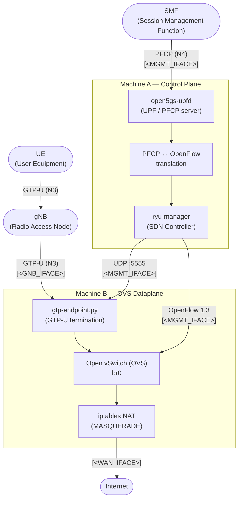

# Deployment Guide

> **Prerequisites:** Fresh Ubuntu Server 22.04 installation. All commands are run as `root`.

---

## Network Topology

| Variable | Description |
|---|---|
| `<MACHINE_A_IP>` | IP of Machine A on the shared management network |
| `<MACHINE_B_IP>` | IP of Machine B on the shared management network |
| `<GTP_SERVER_IP>` | IP of Machine B on the RAN-facing network (gNB network) |
| `<WAN_IFACE>` | WAN / NAT interface (internet access) |
| `<MGMT_IFACE>` | Management interface shared between Machine A and Machine B |
| `<GNB_IFACE>` | RAN-facing interface on Machine B (gNB network) |

---

## Architecture Diagram



---

## Machine A — PFCP↔OpenFlow Translation & SDN Controller

Machine A has two network interfaces:
- `<MGMT_IFACE>` — host-only, shared with the SMF and Machine B
- `<WAN_IFACE>` — NAT to the internet

### 1. Configure Network Interfaces

```bash
vi /etc/netplan/01-host-only-config.yaml
```

```yaml
network:
  version: 2
  ethernets:
    <WAN_IFACE>:
      dhcp4: yes
    <MGMT_IFACE>:
      dhcp4: no
      addresses: [<MACHINE_A_IP>/24]
```

```bash
netplan apply
```

### 2. Clone the Repository

```bash
git clone https://github.com/kubaq215/magisterka.git
cd magisterka
git checkout alternatywne_odchudzanie
```

### 3. Install Dependencies for `myupf-package`

> Reference: [Open5GS build guide](https://open5gs.org/open5gs/docs/guide/02-building-open5gs-from-sources/)

```bash
apt install python3-pip python3-setuptools python3-wheel ninja-build build-essential \
  flex bison git cmake libsctp-dev libgnutls28-dev libgcrypt-dev libssl-dev \
  libmongoc-dev libbson-dev libyaml-dev libnghttp2-dev libmicrohttpd-dev \
  libcurl4-gnutls-dev libtins-dev libtalloc-dev meson
```

```bash
if apt-cache show libidn-dev > /dev/null 2>&1; then
    apt-get install -y --no-install-recommends libidn-dev
else
    apt-get install -y --no-install-recommends libidn11-dev
fi
```

### 4. Build

```bash
cd myupf-package
./compile.sh
```

### 5. Configure the UPF

```bash
vi install/etc/open5gs/upf.yaml
```

```yaml
...
upf:
  pfcp:
    server:
      - address: <MACHINE_A_IP>
    client:
#      smf:     # UPF PFCP Client tries to associate with SMF PFCP Server
#        - address: <SMF_IP>
  gtpu:
    server:
      - address: <GTP_SERVER_IP>
...
```

### 6. Start the UPF

```bash
./install/bin/open5gs-upfd
```

### 7. Configure the SDN Controller

In a new terminal:

```bash
cd magisterka
vi upf_controller.ini
```

```ini
...
[gtp]
# IP address and UDP port of the GTP endpoint (gtp-endpoint.py)
endpoint_ip   = <MACHINE_B_IP>
endpoint_port = 5555

[controller]
# IP address and TCP port the OpenFlow controller listens on.
# Pass the same values to OVS:
#   ovs-vsctl set-controller br0 tcp:<ip>:<port>
ip   = <MACHINE_A_IP>
port = 6653
...
```

### 8. Install Ryu and Apply Compatibility Patch

```bash
pip install ryu
```

Patch the `eventlet` library to restore compatibility with Ryu:

```bash
python3 -c "
path = '/usr/local/lib/python3.10/dist-packages/eventlet/wsgi.py'
with open(path, 'r') as f:
    content = f.read()
if 'ALREADY_HANDLED' not in content:
    content = 'ALREADY_HANDLED = object()\n' + content
    with open(path, 'w') as f:
        f.write(content)
    print('Patched eventlet.wsgi')
else:
    print('ALREADY_HANDLED already present')
"
```

### 9. Start the SDN Controller

```bash
ryu-manager upf_controller.py
```

---

## Machine B — OVS Dataplane & GTP Endpoint

Machine B has three network interfaces:
- `<WAN_IFACE>` — NAT to the internet
- `<MGMT_IFACE>` — host-only, shared with Machine A
- `<GNB_IFACE>` — host-only, shared with the gNB

### 1. Configure Network Interfaces

```bash
vi /etc/netplan/01-host-only-config.yaml
```

```yaml
network:
  version: 2
  ethernets:
    <WAN_IFACE>:
      dhcp4: yes
    <MGMT_IFACE>:
      dhcp4: no
      addresses: [<MACHINE_B_IP>/24]
    <GNB_IFACE>:
      dhcp4: no
      addresses: [<GTP_SERVER_IP>/24]
```

```bash
netplan apply
```

### 2. Install Open vSwitch

```bash
apt install openvswitch-switch openvswitch-common
```

### 3. Clone the Repository

```bash
git clone https://github.com/kubaq215/magisterka.git
cd magisterka
git checkout alternatywne_odchudzanie
```

### 4. Install Dependencies and Start the GTP Endpoint

```bash
apt install python3-pip
pip install scapy
```

In a new terminal:

```bash
python3 gtp-endpoint.py --control-ip <MACHINE_B_IP>
```

### 5. Set Up OVS and NAT

```bash
./ovs-setup.sh

ovs-vsctl set-controller br0 tcp:<MACHINE_A_IP>:6653
ovs-vsctl set bridge br0 protocols=OpenFlow13

iptables -t nat -A POSTROUTING -s 10.45.0.0/16 -o <WAN_IFACE> -j MASQUERADE
```