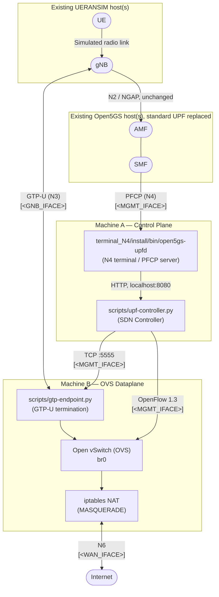

# Deployment Guide

> **Prerequisites:** Fresh Ubuntu Server 22.04 installation. All commands are run as `root`.

## What Machines A and B Replace

Machines A and B are two additional VMs connected to an **existing, working Open5GS and UERANSIM laboratory**. They jointly replace the standard UPF, not the entire 5G core or the simulator:

| Host or role | Components | Responsibility |
|---|---|---|
| Existing Open5GS host(s) | AMF, SMF, other core functions and subscriber database | Keep registration, authentication and session control running |
| Existing UERANSIM host(s) | Simulated gNB and UE | Keep the existing access network and subscriber configuration |
| Machine A | `terminal_N4/` and `scripts/upf-controller.py` | Receive PFCP from the existing SMF and configure Machine B |
| Machine B | `scripts/gtp-endpoint.py`, OVS, Linux routing and NAT | Terminate N3 tunnels from the gNB and forward UE traffic to the data network over N6 |

Machine A is **not** the SMF or AMF. Machine B is **not** the gNB or UE. The terminal N4 and controller run together on Machine A and communicate over local HTTP at `127.0.0.1:8080`. UE data packets traverse Machine B, not Machine A.

Only the UPF selected for the test sessions changes. The existing gNB–AMF connection over N2 remains unchanged. No source-code changes are needed in the existing Open5GS control-plane functions or UERANSIM; their integration settings are described below.

---

## Network Topology

| Variable | Description |
|---|---|
| `<MACHINE_A_IP>` | IP of Machine A on the shared management network |
| `<MACHINE_B_IP>` | IP of Machine B on the shared management network |
| `<GTP_SERVER_IP>` | IP of Machine B on the RAN-facing network (gNB network) |
| `<SMF_N4_IP>` | Existing SMF's local PFCP address, reachable from Machine A |
| `<AMF_N2_IP>` | Existing AMF's NGAP address, reachable from the gNB |
| `<GNB_N2_IP>` | gNB host's local address for communication with the AMF |
| `<GNB_N3_IP>` | gNB host's local GTP-U address, reachable from Machine B |
| `<WAN_IFACE>` | WAN / NAT interface (internet access) |
| `<MGMT_IFACE>` | Management interface shared between Machine A and Machine B |
| `<GNB_IFACE>` | RAN-facing interface on Machine B (gNB network) |

The management network connects the SMF, Machine A and Machine B. The N3 network connects the gNB's GTP-U interface to Machine B. Keep the existing N2 network between gNB and AMF. Machine B needs an external-network interface for UE traffic; Machine A needs Internet access only for installation. In VirtualBox, host-only networks can provide the laboratory links and a NAT adapter can provide Internet access.

Allow bidirectional traffic for these connections within the trusted laboratory:

| Connection | Transport and destination |
|---|---|
| SMF ↔ terminal N4 on A | PFCP, UDP 8805 |
| gNB ↔ GTP endpoint on B | GTP-U, UDP 2152 |
| OVS on B → controller on A | OpenFlow, TCP 6653 |
| Controller on A → GTP endpoint on B | JSON control, TCP 5555 |
| Terminal N4 → controller, both on A | HTTP, TCP 8080 on loopback |
| gNB → existing AMF | NGAP, SCTP 38412, unchanged |

Do not expose the adapter's control interfaces to untrusted networks.

---

## Architecture Diagram


```mermaid
flowchart TD
    subgraph ExistingRAN["Existing UERANSIM host(s)"]
        UE(["UE"])
        GNB(["gNB"])
    end
    subgraph ExistingCore["Existing Open5GS host(s), standard UPF replaced"]
        AMF(["AMF"])
        SMF(["SMF"])
        AMF --- SMF
    end
    INTERNET(["Internet"])

    subgraph MachineB["Machine B — OVS Dataplane"]
        direction TB
        GTP["scripts/gtp-endpoint.py<br/>(GTP-U termination)"]
        OVS["Open vSwitch (OVS)<br/>br0"]
        NAT["iptables NAT<br/>(MASQUERADE)"]
        GTP --> OVS
        OVS --> NAT
    end

    subgraph MachineA["Machine A — Control Plane"]
        direction TB
        UPF["terminal_N4/install/bin/open5gs-upfd<br/>(N4 terminal / PFCP server)"]
        CTRL["scripts/upf-controller.py<br/>(SDN Controller)"]
        UPF -- "HTTP, localhost:8080" --> CTRL
    end

    UE -- "Simulated radio link" --> GNB
    GNB -- "N2 / NGAP, unchanged" --> AMF
    GNB <-->|"GTP-U (N3)<br/>[&lt;GNB_IFACE&gt;]"| GTP
    NAT <-->|"N6<br/>[&lt;WAN_IFACE&gt;]"| INTERNET

    SMF -- "PFCP (N4)<br/>[&lt;MGMT_IFACE&gt;]" --> UPF
    CTRL -- "OpenFlow 1.3<br/>[&lt;MGMT_IFACE&gt;]" --> OVS
    CTRL -- "TCP :5555<br/>[&lt;MGMT_IFACE&gt;]" --> GTP
```

---

## Machine A — PFCP↔OpenFlow Translation & SDN Controller

Machine A has two network interfaces:
- `<MGMT_IFACE>` — host-only, shared with the SMF and Machine B
- `<WAN_IFACE>` — NAT to the internet

### 1. Configure Network Interfaces

```bash
vi /etc/netplan/01-host-only-config.yaml
```

```yaml
network:
  version: 2
  ethernets:
    <WAN_IFACE>:
      dhcp4: yes
    <MGMT_IFACE>:
      dhcp4: no
      addresses: [<MACHINE_A_IP>/24]
```

```bash
netplan apply
```

### 2. Clone the Repository

```bash
git clone https://github.com/kubaq215/magisterka.git
cd magisterka
```

### 3. Install Dependencies for `terminal_N4`

> Reference: [Open5GS build guide](https://open5gs.org/open5gs/docs/guide/02-building-open5gs-from-sources/)

```bash
apt install python3-pip python3-setuptools python3-wheel ninja-build build-essential \
  flex bison git cmake libsctp-dev libgnutls28-dev libgcrypt-dev libssl-dev \
  libmongoc-dev libbson-dev libyaml-dev libnghttp2-dev libmicrohttpd-dev \
  libcurl4-gnutls-dev libtins-dev libtalloc-dev meson
```

```bash
if apt-cache show libidn-dev > /dev/null 2>&1; then
    apt-get install -y --no-install-recommends libidn-dev
else
    apt-get install -y --no-install-recommends libidn11-dev
fi
```

### 4. Build

```bash
cd terminal_N4
./compile.sh
```

### 5. Configure the N4 Terminal

Run this step from `terminal_N4/`. Edit the indicated fields without replacing the rest of the configuration.

```bash
vi install/etc/open5gs/upf.yaml
```

```yaml
...
upf:
  pfcp:
    server:
      - address: <MACHINE_A_IP>
    client:
#      smf:     # UPF PFCP Client tries to associate with SMF PFCP Server
#        - address: <SMF_IP>
  gtpu:
    server:
      - address: <MACHINE_A_IP>
        advertise: <GTP_SERVER_IP>
...
```

`gtpu.server.address` must be local to Machine A because the terminal opens a local socket. `advertise` supplies Machine B's N3 address in the signaling used to establish the tunnel. Do not bind Machine A to Machine B's address. Actual UE GTP-U traffic must go to `scripts/gtp-endpoint.py` on Machine B.

### 6. Start the N4 Terminal

```bash
./install/bin/open5gs-upfd
```

### 7. Configure the SDN Controller

In a new terminal:

```bash
cd ~/magisterka
vi scripts/upf-controller.ini
```

```ini
...
[gtp]
# IP address and TCP port of the GTP endpoint (scripts/gtp-endpoint.py)
endpoint_ip   = <MACHINE_B_IP>
endpoint_port = 5555

[controller]
# IP address and TCP port the OpenFlow controller listens on.
# Pass the same values to OVS:
#   ovs-vsctl set-controller br0 tcp:<ip>:<port>
ip   = <MACHINE_A_IP>
port = 6653
...
```

### 8. Install Ryu and Apply Compatibility Patch

```bash
pip install ryu
```

Patch the `eventlet` library to restore compatibility with Ryu:

```bash
python3 -c "
path = '/usr/local/lib/python3.10/dist-packages/eventlet/wsgi.py'
with open(path, 'r') as f:
    content = f.read()
if 'ALREADY_HANDLED' not in content:
    content = 'ALREADY_HANDLED = object()\n' + content
    with open(path, 'w') as f:
        f.write(content)
    print('Patched eventlet.wsgi')
else:
    print('ALREADY_HANDLED already present')
"
```

### 9. Start the SDN Controller

```bash
ryu-manager scripts/upf-controller.py
```

The HTTP address must match `host=127.0.0.1` and `port=8080` in `terminal_N4/configs/upf-controller.conf`. This is a connection inside Machine A, not a connection to Machine B.

---

## Machine B — OVS Dataplane & GTP Endpoint

Machine B has three network interfaces:
- `<WAN_IFACE>` — NAT to the internet
- `<MGMT_IFACE>` — host-only, shared with Machine A
- `<GNB_IFACE>` — host-only, shared with the gNB

### 1. Configure Network Interfaces

```bash
vi /etc/netplan/01-host-only-config.yaml
```

```yaml
network:
  version: 2
  ethernets:
    <WAN_IFACE>:
      dhcp4: yes
    <MGMT_IFACE>:
      dhcp4: no
      addresses: [<MACHINE_B_IP>/24]
    <GNB_IFACE>:
      dhcp4: no
      addresses: [<GTP_SERVER_IP>/24]
```

```bash
netplan apply
```

### 2. Install Open vSwitch

```bash
apt install openvswitch-switch openvswitch-common
```

### 3. Clone the Repository

```bash
git clone https://github.com/kubaq215/magisterka.git
cd magisterka
```

### 4. Start the GTP Endpoint

In a new terminal:

```bash
cd ~/magisterka
python3 scripts/gtp-endpoint.py --control-ip <MACHINE_B_IP>
```

### 5. Set Up OVS and NAT

```bash
cd ~/magisterka
./scripts/ovs-setup.sh

ovs-vsctl set-controller br0 tcp:<MACHINE_A_IP>:6653
ovs-vsctl set bridge br0 protocols=OpenFlow13
```

---

## Connect the Existing Open5GS Core

On the existing SMF host, edit `smf.yaml` (usually `/etc/open5gs/smf.yaml`). Merge this fragment into the existing configuration, preserving SBI, session, DNN and slice settings:

```yaml
smf:
  pfcp:
    server:
      - address: <SMF_N4_IP>
    client:
      upf:
        - address: <MACHINE_A_IP>
```

`SMF_N4_IP` must belong to the SMF host and be reachable from Machine A. A loopback address such as `127.0.0.4` cannot serve communication between VMs. Replace the old UPF entry for the test DNN with Machine A's address, **not Machine B's address**. In a multi-UPF configuration, retain the selection rules and change only the entry used by the test.

In a single-UPF laboratory, end the test UE session and stop the original UPF before switching over. Do not stop the other core functions. For a package installation using systemd:

```bash
# On the original UPF host, not on Machine A
systemctl stop open5gs-upfd
# On the existing SMF host, after the adapter is ready
systemctl restart open5gs-smfd
```

The first command refers to the original UPF service, not the custom terminal binary under `terminal_N4/`. Do not interrupt UPFs serving unrelated sessions.

Keep subscriber data, PLMN, S-NSSAI and DNN consistent with the existing UERANSIM configuration. `scripts/ovs-setup.sh` assumes the UE pool `10.45.0.0/16` and transit network `10.99.0.0/30`. The SMF and terminal N4 UE pools must match the route and NAT rule in that script. Adapt those rules if the existing deployment uses a different UE subnet, and avoid overlap with management or N3 networks.

## Connect the Existing UERANSIM

Check these fields in the gNB configuration file already used by UERANSIM:

```yaml
ngapIp: <GNB_N2_IP>
gtpIp: <GNB_N3_IP>
amfConfigs:
  - address: <AMF_N2_IP>
    port: 38412
```

- `ngapIp` and `gtpIp` are **local addresses of the gNB host**. Do not set `gtpIp` to Machine B's address.
- `amfConfigs` still points to the existing AMF, not Machine A.
- The gNB's `gtpIp` must be reachable from `GTP_SERVER_IP` on Machine B, and vice versa. If these links already work, the addresses need not change.
- The gNB receives the remote N3 address of Machine B and tunnel TEID through session setup signaling relayed by the AMF. Do not manually put the remote UPF address in the fields above.
- Keep gNB `linkIp` and UE `gnbSearchList` unchanged: they describe the existing UE–gNB connection, not the adapter.

Re-establish the UE's PDU session after changing the UPF so that the gNB receives the new N3 tunnel parameters.

## Startup Order and Integration Checks

After configuring the components:

1. End the test UE session and stop only the standard UPF being replaced.
2. Start the GTP endpoint on B, then configure OVS on B.
3. Start the SDN controller on A and check the OVS connection.
4. Start the N4 terminal on A.
5. Restart the existing SMF with the updated configuration and verify PFCP association with A.
6. Start the UERANSIM gNB and UE, or re-establish their PDU session. Keep the remaining Open5GS functions running.

On Machine B:

```bash
ovs-vsctl show
ovs-ofctl -O OpenFlow13 dump-ports-desc br0
ovs-ofctl -O OpenFlow13 dump-flows br0
```

On the UERANSIM UE host, after session establishment:

```bash
ping -I uesimtun0 1.1.1.1
```

N4 captures should show the SMF communicating with Machine A. N3 captures should show `GNB_N3_IP` communicating with `GTP_SERVER_IP` on Machine B. Successful registration alone only verifies the AMF path; successful bidirectional UE traffic is also needed to verify integration of the replacement UPF.